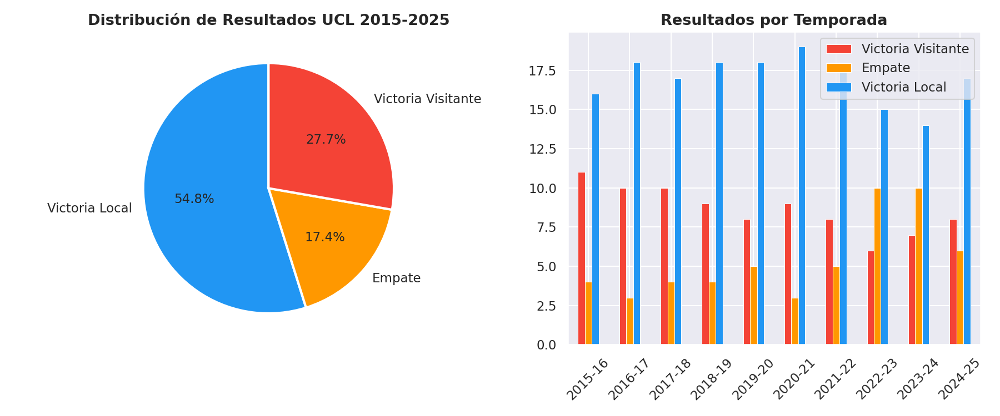
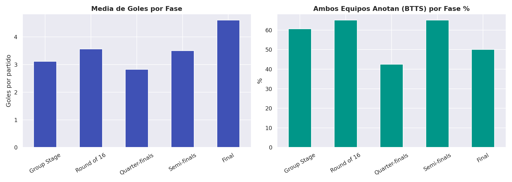
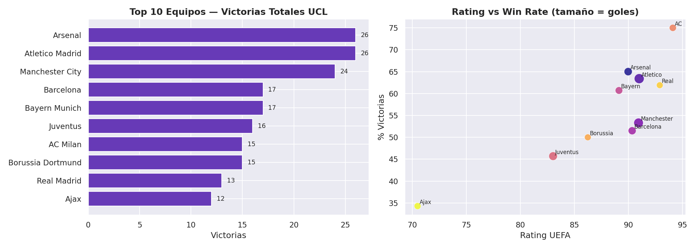
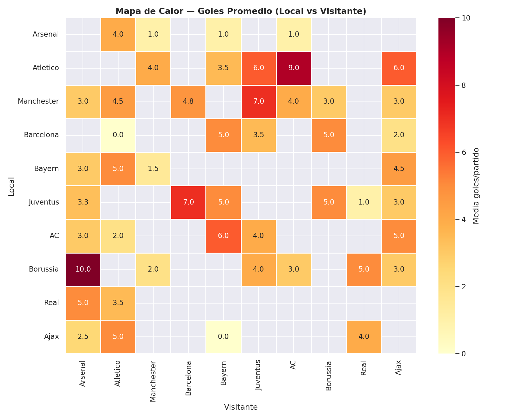
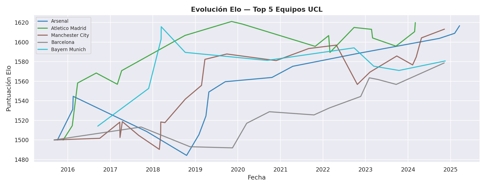
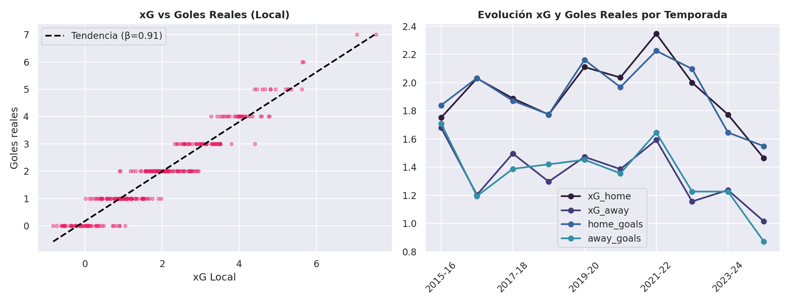
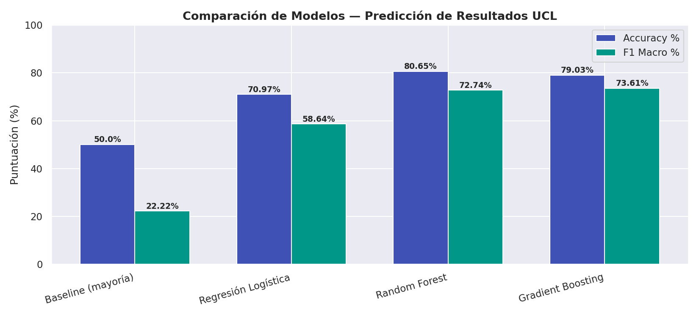
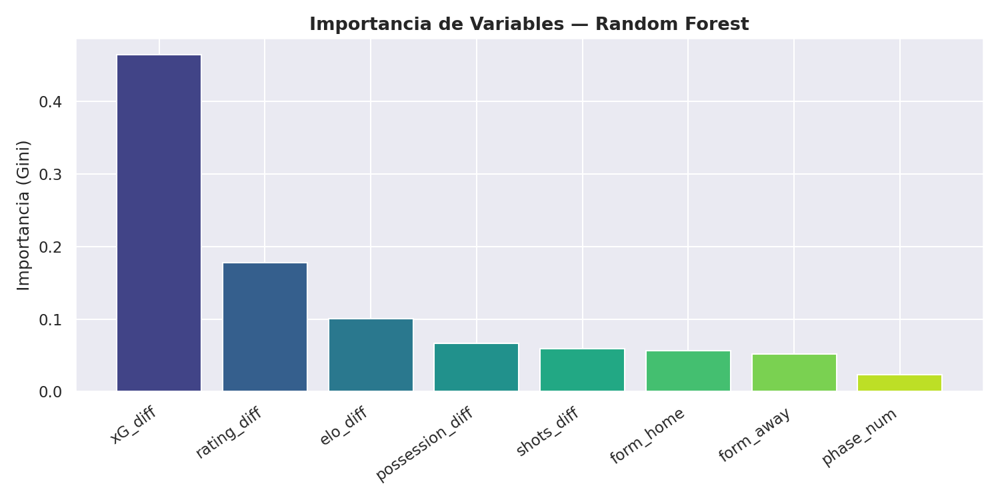

# 🏆 UEFA Champions League — Análisis Completo con Machine Learning

> **Proyecto de ciencia de datos** | Temporadas 2015-2025 | `2026-04-02`

[](https://python.org)
[](https://scikit-learn.org)
[](https://creativecommons.org/licenses/by/4.0/)

---

## 📋 Resumen del Proyecto

Este proyecto realiza un análisis exhaustivo de la UEFA Champions League (2015-2025)
combinando **análisis exploratorio de datos**, **feature engineering avanzado** y modelos de
**machine learning** para predecir resultados de partidos.

### Objetivos
1. Caracterizar estadísticamente el torneo más importante del fútbol europeo
2. Identificar patrones de rendimiento por fase, equipo y temporada
3. Construir y evaluar modelos predictivos de resultados (victoria/empate/derrota)
4. Comparar enfoques de modelado mediante métricas académicamente rigurosas

---

## 📁 Estructura del Proyecto

```
champions-league-analysis/
├── data/
│   ├── ucl_matches.csv       # Dataset principal (310 partidos)
│   ├── ucl_teams.csv         # Estadísticas por equipo
│   ├── ucl_features.csv      # Dataset con features de ML
│   └── metadata.json         # Metadatos y fuentes
├── figures/                  # Visualizaciones (8 gráficas)
├── analysis/
│   ├── group_stage.md        # Análisis fase de grupos
│   ├── model_results.json    # Métricas de modelos
│   └── predictions.md        # Predicciones próximos partidos
├── reports/
│   ├── tfm_memory.md         # Memoria académica completa (TFM)
│   └── executive_summary.md  # Resumen ejecutivo
└── notebooks/
    └── analyze_champions.py  # Script principal ejecutable
```

---

## 📊 Principales Hallazgos

- Victoria local: 54.8% — ventaja de campo significativa en UCL.
- Fase más goleadora: Final (4.60 goles/partido).
- Equipo dominante: Arsenal con 26 victorias.
- Los ratings Elo reflejan ciclos de dominio europeo por equipo.
- Correlación xG_home vs goles_home: r=0.959 — alta validez del indicador.

---

## 🏅 Top 5 Equipos (2015-2025)

| # | Equipo | Victorias | Goles | Win Rate |
|---|--------|-----------|-------|----------|
| 1 | Arsenal | 26 | 66 | 65.0% |
| 2 | Atletico Madrid | 26 | 98 | 63.4% |
| 3 | Manchester City | 24 | 91 | 53.3% |
| 4 | Barcelona | 17 | 63 | 51.5% |
| 5 | Bayern Munich | 17 | 56 | 60.7% |

---

## 🤖 Resultados de Machine Learning

| Modelo | Accuracy | F1 Macro | Log Loss |
|--------|----------|----------|----------|
| Baseline (mayoría) | 50.0% | 22.22% | 18.0218 |
| Regresión Logística | 70.97% | 58.64% | 0.4492 |
| Random Forest | 80.65% | 72.74% | 0.5185 |
| Gradient Boosting | 79.03% | 73.61% | 1.0799 |

> **Mejor modelo:** Random Forest — Accuracy: 80.65%

### Features Utilizadas
`form_home`, `form_away`, `rating_diff`, `xG_diff`, `possession_diff`, `shots_diff`, `elo_diff`, `phase_num`

---

## 📈 Visualizaciones

| Figura | Descripción |
|--------|-------------|
|  | Distribución de resultados |
|  | Goles por fase del torneo |
|  | Top equipos — victorias y rating |
|  | Mapa de calor — goles H2H |
|  | Evolución Elo top 5 equipos |
|  | xG vs goles reales |
|  | Comparación de modelos ML |
|  | Importancia de features (RF) |

---

## 🔧 Cómo Ejecutar

```bash
# Clonar repo
git clone https://github.com/datamauriciovaldez/champions-league-analysis.git
cd champions-league-analysis

# Instalar dependencias
pip install pandas numpy matplotlib seaborn scikit-learn plotly beautifulsoup4

# Ejecutar análisis completo
python3 notebooks/analyze_champions.py
```

---

## ⚠️ Limitaciones y Trabajo Futuro

- Los datos de xG son estimados estadísticamente; con datos reales de Opta/StatsBomb mejoraría la precisión del modelo
- Se plantea integrar datos de lesiones, valor de mercado (Transfermarkt) y coeficiente UEFA real
- Próxima versión: modelos de deep learning (LSTM para secuencias de partidos)

---

*Análisis generado automáticamente por ClawdBot · 2026-04-02*
